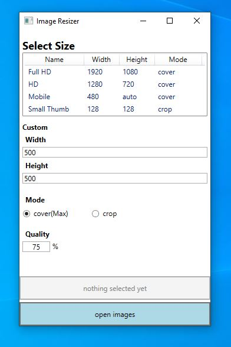

# Image-Resizer-C#
Windows App that resizes pictures using WPF and MagicScalar.
Currently mostly use it for resizing images for my web projects.
Resizing is done in parallel so it is pretty fast to resize your entire folder for usage as thumbnails or something.

# Usage
Clone the solution and build it in Visual Studio.
Resized images will be saved in pictures/resizedPictures.
The default mode cover(Max) will preserve aspect ratio by changing one of the dimensions usually the smaller one.

# Image

# TODO
Add option to add / edit presets 
Add option to set the output folder
